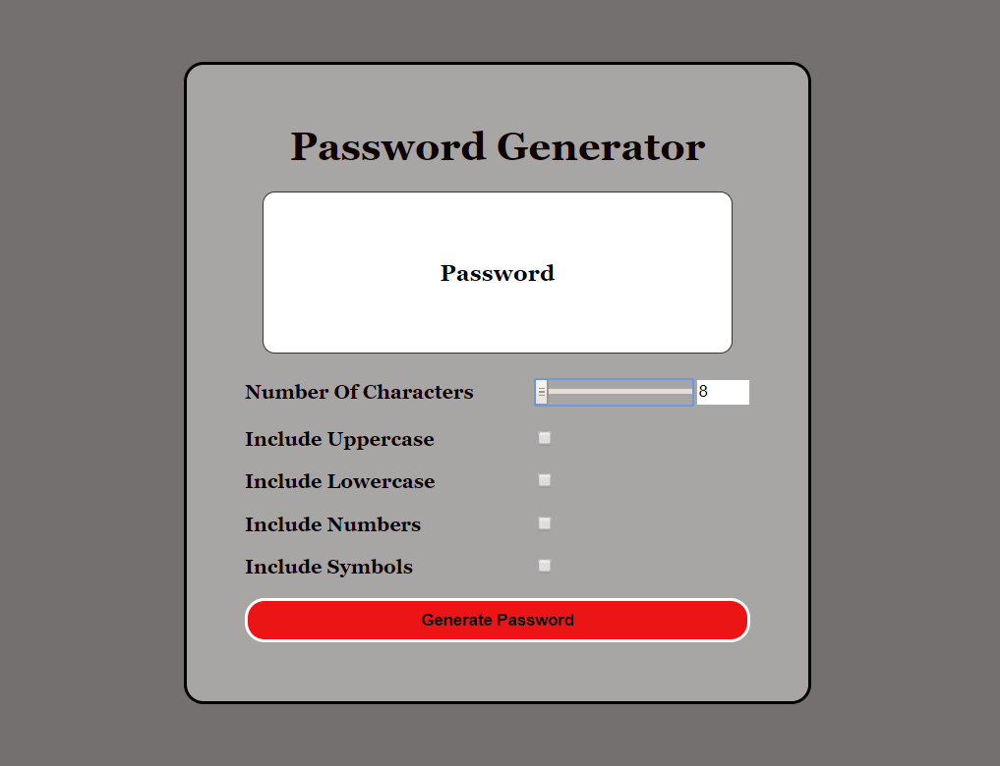

# Sam Ahalim

 

 # GitHub URL
https://github.com/HusamAhalim/password

 # Live URL

https://husamahalim.github.io/password/
 # Code Example

Current projects is to create a random password generator using javascript, HTML, CSS. This Generator will allow the user to generate a secure random password with a min of 8 chracters and a max of 128 characters.

# Business Context

For any business or company that handles any type of sensitive data, A weak passwords is a real security threat. Not only is it a threat to that company, But also it's customers as well as that companys reputation An application that can generate a strong passwords quickly and effortlessly can ensures that their data is secure.

